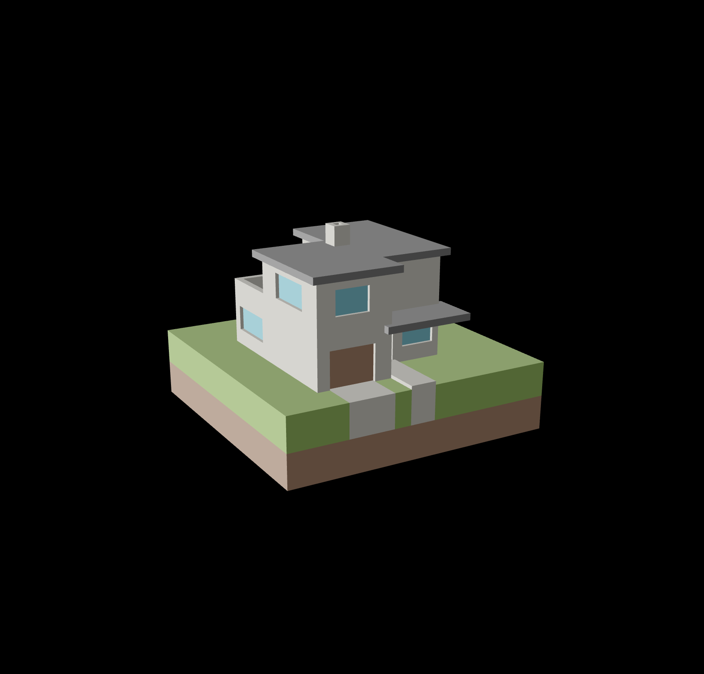

# Learning how to graphic

- [x] Implement [Phong shading](https://en.wikipedia.org/wiki/Phong_shading)
  - [x] directional light
  - [x] point light with attenuation
- [x] Render models from a .obj file with textures
- [ ] render shadows from directional light
- [ ] from point light
- [ ] reuse shader code

### Screenshots

illuminated_bunny.ts

illuminated_house.ts

<iframe src='https://gfycat.com/ifr/SingleTerribleBrahmancow' frameborder='0' scrolling='no' width='100%' height='100%' style='position:absolute;top:0;left:0;' allowfullscreen></iframe>

